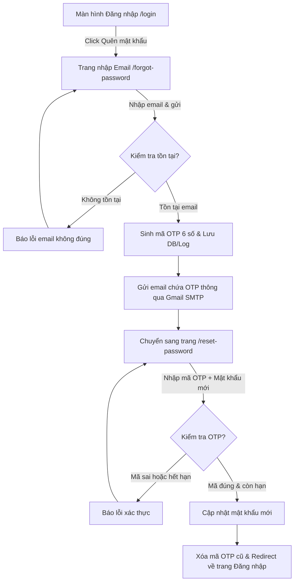

# Hướng Dẫn Cấu Hình Và Gửi Mã OTP 6 Số Về Gmail Khi Quên Mật Khẩu

Hệ thống **MobiFone WorkHub** tích hợp sẵn chức năng khôi phục mật khẩu thông qua việc gửi mã OTP ngẫu nhiên gồm **6 chữ số** về địa chỉ Gmail của người dùng. Dưới đây là tài liệu hướng dẫn chi tiết cách cấu hình mail server và quy trình lấy lại mật khẩu.

---

## 1. Cơ chế hoạt động của mã OTP 6 số

1. **Sinh mã ngẫu nhiên:** Khi người dùng nhập email hợp lệ ở trang quên mật khẩu, hệ thống dùng hàm `mt_rand(100000, 999999)` để sinh ra mã 6 chữ số.
2. **Lưu trữ bảo mật:** Mã OTP được lưu tạm thời vào bảng `password_resets` kèm theo mốc thời gian (`created_at`).
3. **Thời gian hiệu lực:** Mã xác thực này có thời hạn sử dụng là **15 phút**. Quá thời gian này mã sẽ tự động hết hạn và không thể sử dụng.
4. **Ghi log dự phòng:** Trong trường hợp chạy dưới môi trường Local Dev chưa cấu hình xong SMTP để gửi mail, mã OTP vẫn luôn được ghi lại trong file log tại [laravel.log](file:///d:/mobifone/hr-manager/storage/logs/laravel.log) với dòng chữ:
   ```text
   =================================================================
   MA_XAC_THUC_CUA_BAN_LA: xxxxxx
   =================================================================
   ```

---

## 2. Cấu hình gửi mail qua SMTP Gmail

Để hệ thống gửi được email thực tế về tài khoản Gmail của người dùng, bạn cần cấu hình các thông số kết nối Mail Server trong file [`.env`](file:///d:/mobifone/hr-manager/.env) của dự án.

### Bước 2.1: Tạo Mật khẩu ứng dụng (App Password) từ Google
Do chính sách bảo mật của Google, bạn không thể sử dụng mật khẩu đăng nhập Gmail thông thường để cấu hình SMTP. Bạn phải tạo **Mật khẩu ứng dụng (App Password)** gồm 16 ký tự:

1. Truy cập vào trang quản lý tài khoản Google của bạn tại: [https://myaccount.google.com/](https://myaccount.google.com/)
2. Chuyển sang tab **Bảo mật (Security)** ở menu bên trái.
3. Tại phần *Cách bạn đăng nhập vào Google*, đảm bảo **Xác minh 2 bước (2-Step Verification)** đã được bật.
4. Nhấn vào mục **Xác minh 2 bước**, cuộn xuống dưới cùng và chọn **Mật khẩu ứng dụng (App passwords)**.
5. Ở ô *Chọn ứng dụng*, nhập tên bất kỳ (ví dụ: `MobiFone WorkHub`) rồi nhấn nút **Tạo (Create)**.
6. Một cửa sổ hiện ra chứa **mã bảo mật gồm 16 chữ cái màu vàng**. Hãy sao chép mã này lại (lưu ý: loại bỏ mọi dấu cách khi paste vào cấu hình).

### Bước 2.2: Cập nhật cấu hình trong file `.env`
Mở file [`.env`](file:///d:/mobifone/hr-manager/.env) tại thư mục gốc của dự án và điền các thông số như dưới đây:

```env
MAIL_MAILER=smtp
MAIL_HOST=smtp.gmail.com
MAIL_PORT=587
MAIL_USERNAME=tentaikhoan@gmail.com
MAIL_PASSWORD=xxxxypzqpzyqxxxx
MAIL_ENCRYPTION=tls
MAIL_FROM_ADDRESS="tentaikhoan@gmail.com"
MAIL_FROM_NAME="MobiFone WorkHub"
```

> [!IMPORTANT]
> - Thay `tentaikhoan@gmail.com` bằng địa chỉ Gmail bạn dùng làm server gửi thư đi.
> - Thay `xxxxypzqpzyqxxxx` bằng **mật khẩu ứng dụng 16 ký tự** vừa tạo ở bước trên (viết liền không khoảng trắng).
> - Nhớ chạy lệnh xóa cache cấu hình để Laravel áp dụng cài đặt mới:
>   ```bash
>   php artisan config:clear
>   ```

---

## 3. Quy trình thực hiện phía người dùng (User Flow)

Quy trình khôi phục mật khẩu hoạt động theo luồng sau:



### Chi tiết các bước:
1. **Yêu cầu cấp lại:** Tại trang Đăng nhập, người dùng nhấn chọn **Quên mật khẩu?**.
2. **Gửi yêu cầu:** Nhập địa chỉ email đăng ký trên hệ thống rồi nhấn **Gửi yêu cầu**.
3. **Nhận mã:** Kiểm tra hộp thư Gmail (kể cả thư rác/spam). Nếu dùng localhost không có mạng hoặc cấu hình SMTP lỗi, nhà phát triển có thể mở file `storage/logs/laravel.log` để lấy mã.
4. **Đổi mật khẩu:** Nhập mã OTP gồm 6 chữ số, điền mật khẩu mới (tối thiểu 8 ký tự), điền xác nhận mật khẩu mới rồi nhấn **Cập nhật mật khẩu**.
5. **Hoàn tất:** Đăng nhập lại với mật khẩu mới vừa tạo.

---

## 4. Các lỗi thường gặp và cách xử lý (Troubleshooting)

### 🚨 Lỗi 1: `Connection could not be established with host` hoặc `535 5.7.8 Username and Password not accepted`
*   **Nguyên nhân:** Do bạn điền sai địa chỉ email hoặc điền mật khẩu đăng nhập Gmail thông thường thay vì mật khẩu ứng dụng (App Password).
*   **Cách xử lý:** 
    1. Đảm bảo tài khoản Gmail gửi đã bật Xác minh 2 bước.
    2. Tạo mật khẩu ứng dụng mới và copy đúng 16 ký tự không dấu cách vào `MAIL_PASSWORD`.
    3. Đảm bảo cấu hình cổng port `587` đi kèm với encryption là `tls`.
    4. Chạy lại lệnh `php artisan config:clear`.

### 🚨 Lỗi 2: Bấm gửi báo thành công nhưng không có thư trong Gmail và không có lỗi hiển thị trên màn hình
*   **Nguyên nhân:** Để tránh việc hệ thống bị lỗi nghiêm trọng khi cấu hình mail chưa đúng trên máy lập trình viên, `ForgotPasswordController` đã được bọc trong khối `try-catch`. Nếu có lỗi gửi mail, hệ thống sẽ ghi lỗi vào log và vẫn cho phép giao diện chuyển hướng để người dùng lấy OTP từ log.
*   **Cách xử lý:** Mở file log `storage/logs/laravel.log` cuộn xuống cuối cùng để tìm xem có log lỗi `Lỗi gửi mail: ...` hay không để chuẩn đoán chính xác nguyên nhân.
